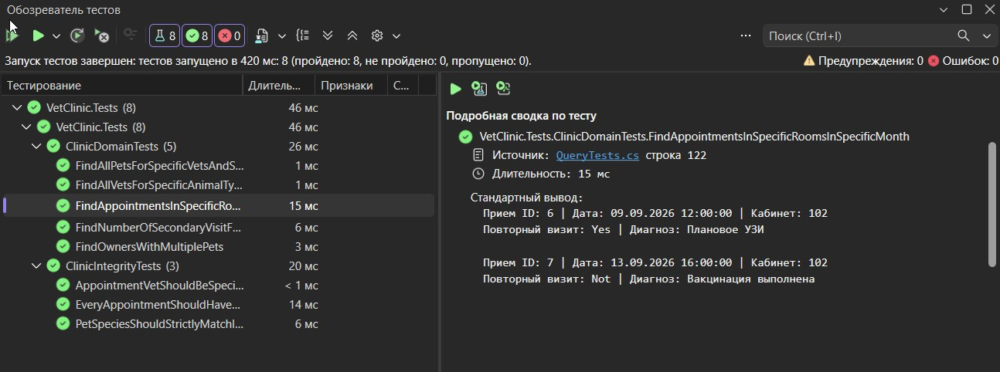

# Разработка корпоративных приложений — лабораторная работа №1

## «Классы»

В рамках первой лабораторной работы реализована объектно-ориентированная модель **ветеринарной клиники**, подготовлены тестовые данные и unit-тесты с использованием LINQ.

Данные хранятся **в памяти в виде коллекций**.

Вариант: 19

---

## Предметная область

Проект моделирует работу ветеринарной клиники.

### Основные сущности

| Класс | Назначение |
|---|---|
| `Owner` | Владелец животного |
| `Pet` | Питомец |
| `Breed` | Кличка животного |
| `Vet` | Ветеринар |
| `Specialization` | Специализация врача |
| `Service` | Оказанная услуга |
| `Appointment` | Запись на приём |

### Перечисления

`Species` —  виды животных:

- `Cat`
- `Dog`
- `Pigeon`
- `Rabbit`
- `Horse`

`RepeatVisitIndicator` — индикатор повторного визита:

- `No`
- `Yes`


---

## Связи между сущностями

Основные связи предметной области:
- `Appointment` содержит информацию о `Pet`, `Vet`, `Service`
- `Pet` содержит информацию о `Owner` и `Breed`
- `Vet` и `Service` содержат информацию о `Specialization`
- `Specialization`, `Pet` и `Breed` содержат информацию о `Species`
---

## Fixture

Класс `VetClinicFixture` содержит коллекции:

```csharp
public List<Breed> Breeds { get; };
public List<Owner> Owners { get; };
public List<Specialization> Specializations { get; };
public List<Vet> Vets { get; };
public List<Service> Services { get; };
public List<Appointment> Appointment { get; };
```

В фикстуре создаются:
- 15 пород животных;
- 11 владельцев животных;
- 10 специализаций;
- 10 врачей;
- 15 услуг;
- 17 питомцев;
- 17 обращений.
---

## Unit-тесты

Тесты находятся в проекте `VetClinic.Tests`.

Для повторного использования одного набора данных используется `VetClinicFixture`. 

### `DomainTests`

Тесты проверяют корректность созданного датасета и основных связей.

### `QueriesTests`

В тестах реализованы LINQ-запросы.

---

## Запуск тестов

```powershell
dotnet test
```

## Результаты
